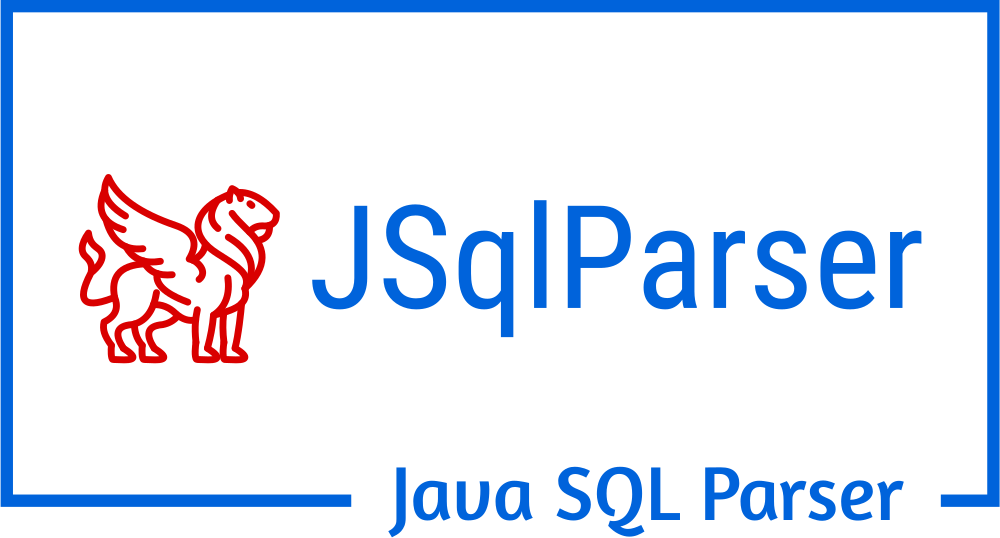

# [JSqlParser (4.6 Stable or 4.7 Snapshot)](https://jsqlparser.github.io/JSqlParser) 


[](https://travis-ci.com/JSQLParser/JSqlParser)   [](https://coveralls.io/r/JSQLParser/JSqlParser?branch=master)
[](https://www.codacy.com/gh/JSQLParser/JSqlParser/dashboard?utm_source=github.com&amp;utm_medium=referral&amp;utm_content=JSQLParser/JSqlParser&amp;utm_campaign=Badge_Grade)
[](http://maven-badges.herokuapp.com/maven-central/com.github.jsqlparser/jsqlparser)
[](https://www.javadoc.io/doc/com.github.jsqlparser/jsqlparser)

[](https://gitter.im/JSQLParser/JSqlParser?utm_source=badge&utm_medium=badge&utm_campaign=pr-badge)

## Summary

Please visit the [WebSite](https://jsqlparser.github.io/JSqlParser). **JSqlParser** is a RDBMS agnostic SQL statement parser. It translates SQL statements into a traversable hierarchy of Java classes (see [Samples](https://jsqlparser.github.io/JSqlParser/usage.html#parse-a-sql-statements)):

```sql
SELECT 1 FROM dual WHERE a = b
```

```text
 SQL Text
  └─Statements: net.sf.jsqlparser.statement.select.PlainSelect
      ├─selectItems -> Collection<SelectExpressionItem>
      │  └─selectItems: net.sf.jsqlparser.statement.select.SelectExpressionItem
      │     └─LongValue: 1
      ├─Table: dual
      └─where: net.sf.jsqlparser.expression.operators.relational.EqualsTo
         ├─Column: a
         └─Column: b
```

```java
Statement statement = CCJSqlParserUtil.parse(sqlStr);
if (statement instanceof PlainSelect) {
    PlainSelect plainSelect = (PlainSelect) statement;

    SelectExpressionItem selectExpressionItem =
            (SelectExpressionItem) plainSelect.getSelectItems().get(0);

    Table table = (Table) plainSelect.getFromItem();

    EqualsTo equalsTo = (EqualsTo) plainSelect.getWhere();
    Column a = (Column) equalsTo.getLeftExpression();
    Column b = (Column) equalsTo.getRightExpression();
}
```

## [Supported Grammar and Syntax](https://jsqlparser.github.io/JSqlParser/syntax.html)

**JSqlParser** aims to support the SQL standard as well as all major RDBMS. Any missing syntax or features can be added on demand.

| RDBMS                              | Statements                              |
|------------------------------------|-----------------------------------------|
| Oracle<br>MS SQL Server and Sybase<br>PostgreSQL<br>MySQL and MariaDB<br>DB2<br>H2 and HSQLDB and Derby<br>SQLite| `SELECT`<br>`INSERT`, `UPDATE`, `UPSERT`, `MERGE`<br>`DELETE`, `TRUNCATE TABLE`<br>`CREATE ...`, `ALTER ....`, `DROP ...`<br>`WITH ...` |


**JSqlParser** can also be used to create SQL Statements from Java Code with a fluent API (see [Samples](https://jsqlparser.github.io/JSqlParser/usage.html#build-a-sql-statements)).

## Alternatives to JSqlParser?
[**General SQL Parser**](http://www.sqlparser.com/features/introduce.php?utm_source=github-jsqlparser&utm_medium=text-general) looks pretty good, with extended SQL syntax (like PL/SQL and T-SQL) and java + .NET APIs. The tool is commercial (license available online), with a free download option.

## [Documentation](https://jsqlparser.github.io/JSqlParser)

### [Samples](https://jsqlparser.github.io/JSqlParser/usage.html#parse-a-sql-statements)
### [Build Instructions](https://jsqlparser.github.io/JSqlParser/usage.html)
### [Contribution](https://jsqlparser.github.io/JSqlParser/contribution.html)
### [Change Log](https://jsqlparser.github.io/JSqlParser/changelog.html#latest-changes-since-jsqlparser-version)
### [Issues](https://github.com/JSQLParser/JSqlParser/issues)

## License

**JSqlParser** is dual licensed under **LGPL V2.1** or **Apache Software License, Version 2.0**.
