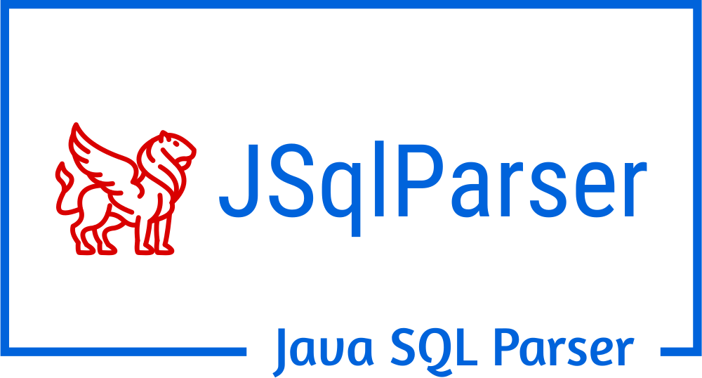

<div align="center">

<table border="0" width="100%"><tr>
<td valign="middle">
<h1><a href="https://jsqlparser.github.io/JSqlParser">JSqlParser</a></h1>
<h3>Turn any SQL statement into a traversable tree of Java objects -- and back again.</h3>
<p>An RDBMS-agnostic SQL parser for the JVM:<br/>one grammar, twelve dialects, no native extensions.</p>
</td>
<td width="270" align="center" valign="middle">
<a href="https://jsqlparser.github.io/JSqlParser">

</a>
</td>
</tr></table>

[](https://github.com/JSQLParser/JSqlParser/actions/workflows/ci.yml)
[](https://coveralls.io/r/JSQLParser/JSqlParser?branch=master)
[](https://www.codacy.com/gh/JSQLParser/JSqlParser/dashboard)
[](https://central.sonatype.com/artifact/com.manticore-projects.jsqlformatter/jsqlparser)
[](https://central.sonatype.com/artifact/com.github.jsqlparser/jsqlparser)
[](https://www.javadoc.io/doc/com.github.jsqlparser/jsqlparser)
[](https://github.com/JSQLParser/JSqlParser/stargazers)
[](https://gitter.im/JSQLParser/JSqlParser)

**[Website](https://jsqlparser.github.io/JSqlParser)** · **[Samples](https://jsqlparser.github.io/JSqlParser/usage.html#parse-a-sql-statements)** · **[Syntax](https://jsqlparser.github.io/JSqlParser/syntax.html)** · **[Change Log](https://jsqlparser.github.io/JSqlParser/changelog.html#latest-changes-since-jsqlparser-version)** · **[Contributing](https://jsqlparser.github.io/JSqlParser/contribution.html)**

</div>

---

## What it does

Give it SQL. Get an AST you can walk, rewrite, and print back out.

```sql
SELECT 1 FROM dual WHERE a = b
```

```text
SQL Text
 └─Statements: statement.select.PlainSelect
    ├─selectItems: statement.select.SelectItem
    │  └─LongValue: 1
    ├─Table: dual
    └─where: expression.operators.relational.EqualsTo
       ├─Column: a
       └─Column: b
```

```java
String sqlStr = "select 1 from dual where a=b";

PlainSelect select = (PlainSelect) CCJSqlParserUtil.parse(sqlStr);

SelectItem selectItem = select.getSelectItems().get(0);
Assertions.assertEquals(new LongValue(1), selectItem.getExpression());

Table table = (Table) select.getFromItem();
Assertions.assertEquals("dual", table.getName());

EqualsTo equalsTo = (EqualsTo) select.getWhere();
Column a = (Column) equalsTo.getLeftExpression();
Column b = (Column) equalsTo.getRightExpression();
Assertions.assertEquals("a", a.getColumnName());
        Assertions.assertEquals("b", b.getColumnName());
```

The tree is traversable with the Visitor pattern, and the same object model works in reverse:
build statements from Java with a [fluent API](https://jsqlparser.github.io/JSqlParser/usage.html#build-a-sql-statements)
and render them as SQL text.

## Install

Use the stable **Manticore builds**. They are released continuously from the current development
line and carry all of the performance and grammar work described below. The upstream
`com.github.jsqlparser` release on Maven Central is considerably older.

```xml
<dependency>
    <groupId>com.manticore-projects.jsqlformatter</groupId>
    <artifactId>jsqlparser</artifactId>
    <version>[5.3.218,)</version>
</dependency>
```

```gradle
implementation("com.manticore-projects.jsqlformatter:jsqlparser:+")
```

<details>
<summary>Upstream release and snapshots</summary>

```xml
<dependency>
    <groupId>com.github.jsqlparser</groupId>
    <artifactId>jsqlparser</artifactId>
    <version>5.3</version>
</dependency>
```

Snapshot coordinates and repository setup are on the
[build dependencies page](https://jsqlparser.github.io/JSqlParser/usage.html#build-dependencies).

</details>

## Performance

**11× faster than 5.3**, and the fastest parser on real-world SQL of any of the parsers
tested, in any language — 19× ahead of `sqlglot[c]` on JSqlParser's own `SELECT` test suite.

<div align="right">
  <a href="https://github.com/manticore-projects/jsqlparser-bench">
    
  </a>
</div>

```text
Benchmark                               (version)  Mode  Cnt   Score   Error  Units
JSQLParserBenchmark.parseSQLStatements     latest  avgt   15   7.602 ± 0.135  ms/op
JSQLParserBenchmark.parseSQLStatements        5.3  avgt   15  84.687 ± 3.321  ms/op
```

Methodology and the full cross-parser comparison against SQLGlot, `sqlglot[c]` and
polyglot-sql: **[jsqlparser-bench](https://github.com/manticore-projects/jsqlparser-bench)**.

## What it parses

JSqlParser targets the SQL standard plus all major RDBMS. One grammar covers all of them,
and missing syntax gets added on demand — [open an issue](https://github.com/JSQLParser/JSqlParser/issues).

<div align="center">

`BigQuery` · `Snowflake` · `DuckDB` · `Redshift` · `Oracle` · `MS SQL Server` · `Sybase`
`PostgreSQL` · `MySQL` · `MariaDB` · `DB2` · `H2` · `HSQLDB` · `Derby` · `SQLite`

</div>

|  | Statements |
|---|---|
| **Queries** | `SELECT` · `WITH …` · Piped SQL |
| **DML** | `INSERT` · `UPDATE` · `UPSERT` · `MERGE` · `DELETE` · `TRUNCATE TABLE` |
| **DDL** | `CREATE …` · `ALTER …` · `DROP …` |
| **PostgreSQL RLS** | `CREATE POLICY` · `ALTER TABLE … ENABLE`/`DISABLE`/`FORCE`/`NO FORCE ROW LEVEL SECURITY` |
| **Salesforce SOQL** | `INCLUDES` · `EXCLUDES` |

Beyond statement shapes, the grammar handles nested sub-selects, bind parameters (`?`,
`:name`), window and analytic functions, Oracle hints, and the T-SQL square-bracket versus
array-literal ambiguity. The complete reference is on the
[syntax page](https://jsqlparser.github.io/JSqlParser/syntax.html).

## Statement classification

Any parsed statement can say what it actually does — no second parse, no visitor to write:

```java
StatementFeatures features = CCJSqlParserUtil.parse(sqlStr).getFeatures();

// safeguard a read-only client before anything reaches the database
if (connection.isReadOnly() && features.mayModifyData()) {
    throw new SQLException("rejected: " + features.getUnresolvedReferences());
}

// dispatch correctly
if (features.returnsResultSet()) { statement.executeQuery(sqlStr);  }
else                             { statement.executeUpdate(sqlStr); }
```

This is not `sqlStr.startsWith("SELECT")` with extra steps. `RETURNING` turns DML into a row
source, a data-modifying CTE hides a `DELETE` inside a `SELECT`, and `INSERT INTO x SELECT ..`
contains a query but returns nothing:

| SQL | returns rows | modifies data |
|---|---|---|
| `SELECT * FROM t` | yes | no |
| `INSERT INTO x SELECT * FROM t` | no | yes |
| `DELETE FROM t RETURNING *` | yes | yes |
| `WITH c AS (DELETE FROM t RETURNING *) SELECT * FROM c` | yes | yes |
| `SELECT nextval('s')` | yes | *unproven* |

Features are not mutually exclusive, and each is three-valued: proven, not excludable, or ruled
out. `is()` answers "did the grammar prove it", `may()` answers "could it be ruled out" — so a
guard uses `may()` and a dispatcher uses `is()`. Function volatility is not a syntactic property,
so anything the caller has not declared pure stays unproven and is listed by name.

## Piped SQL

Support is progressing for Piped SQL, which writes queries in the order they actually
execute rather than the order SQL historically demanded.

```sql
FROM Produce
|> WHERE
    item != 'bananas'
    AND category IN ('fruit', 'nut')
|> AGGREGATE COUNT(*) AS num_items, SUM(sales) AS total_sales
   GROUP BY item
|> ORDER BY item DESC;
```

Background reading: the [Google research paper](https://storage.googleapis.com/gweb-research2023-media/pubtools/1004848.pdf),
[BigQuery pipe syntax](https://cloud.google.com/bigquery/docs/reference/standard-sql/pipe-syntax)
and [DuckDB FROM-first syntax](https://duckdb.org/docs/sql/query_syntax/from.html#from-first-syntax).

## Java version

| JSqlParser | Runtime | Notes |
|------------|---------|-------|
| 4.9 | JDK 8 | last JDK 8 compatible release |
| 5.0 and later | JDK 11 | breaking changes to the AST Visitors, see the Migration Guide |
| 5.1 and later | JDK 11 | building requires a **JDK 17 toolchain** (plugin requirement) |
| 5.4 and later | JDK 11 | parser generated with **JavaCC 8** |

## Sister projects

- **[JSQLFormatter](https://manticore-projects.com/JSQLFormatter/index.html)** — pretty-printing and formatting of SQL text
- **[JSQLTranspiler](https://manticore-projects.com/JSQLTranspiler/index.html)** — dialect-specific rewriting, column resolution and lineage, by [Starlake.ai](https://starlake.ai/)

## Alternatives

The dual-licensed [JOOQ](https://www.jooq.org/doc/latest/manual/sql-building/sql-parser/)
ships a hand-written parser with broad RDBMS support, cross-dialect translation, SQL
transformation, and a JDBC proxy mode. Worth a look if translation between dialects is your
primary need rather than AST access.

## Sponsor

A huge thank you to **[Starlake.ai](https://starlake.ai/)**, who simplify data ingestion,
transformation and orchestration for faster delivery of high-quality data. Starlake has been
instrumental in providing Piped SQL support and a large number of test cases for BigQuery,
Redshift, Databricks and DuckDB. If JSqlParser is useful to you, visit
[Starlake.ai](https://starlake.ai/) and give them a star.

## Documentation

1. [Samples](https://jsqlparser.github.io/JSqlParser/usage.html#parse-a-sql-statements)
2. [Build instructions](https://jsqlparser.github.io/JSqlParser/usage.html) and [Maven artifact](https://jsqlparser.github.io/JSqlParser/usage.html#build-dependencies)
3. [Contribution guide](https://jsqlparser.github.io/JSqlParser/contribution.html)
4. [Change log](https://jsqlparser.github.io/JSqlParser/changelog.html#latest-changes-since-jsqlparser-version)
5. [Issues](https://github.com/JSQLParser/JSqlParser/issues)

## License

Dual licensed under **LGPL 2.1** or the **Apache License, Version 2.0**. Take your pick.
